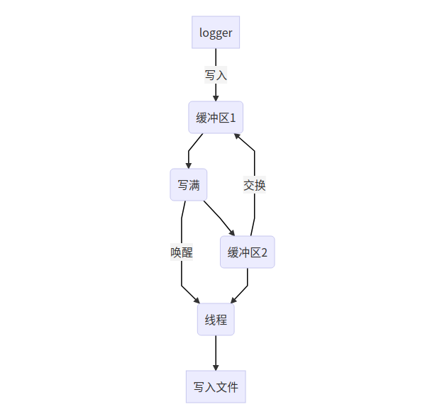
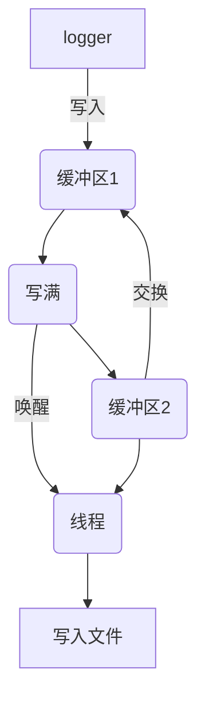

## 异步日志

+ 包含两个缓冲区，一个线程，一个子进程
+ 核心思想：使用两个缓冲区，当一个缓冲区写满时，写另外一个缓冲，同时写入线程将写满的缓冲写入磁盘，避免日志写入时阻塞线程，从而提高写入性能，子进程用于当父进程错误退出是刷新缓冲区，保证所有的日志持久化。

```mermaid
graph TD
logger-->|"写入"|1(缓冲区1)-->f(写满)-->2(缓冲区2)-->|"交换"|1
f-->|"唤醒"|t(线程)-->写入文件
2-->t
```