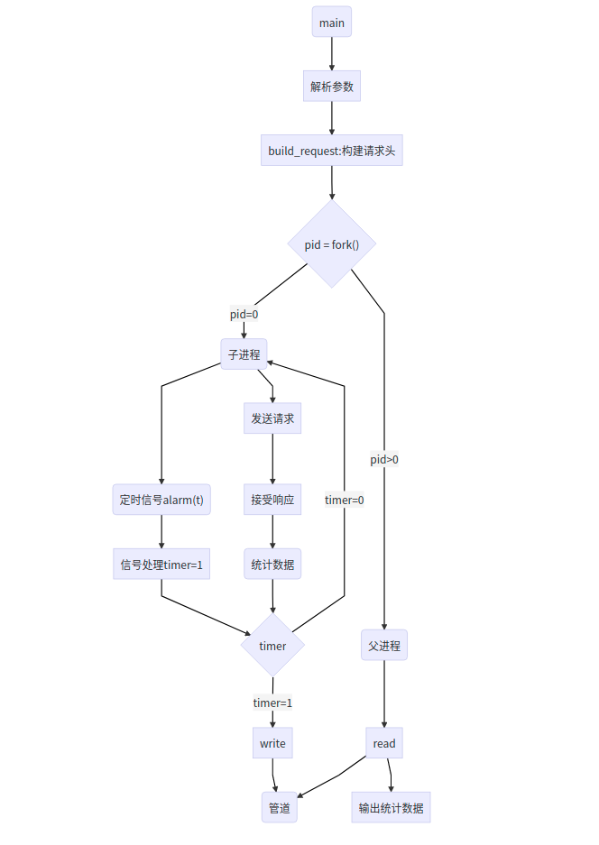

# Webbench

### 服务器测试工具

> **Webbench实现的核心原理是**：父进程fork若干个子进程，每个子进程在用户要求时间或默认的时间内对目标web循环发出实际访问请求，父子进程通过管道进行通信，子进程通过管道写端向父进程传递在若干次请求访问完毕后记录到的总信息，父进程通过管道读端读取子进程发来的相关信息，子进程在时间到后结束，父进程在所有子进程退出后统计并给用户显示最后的测试结果，然后退出。




Usage:

|      参数      |                         用法                         |
| :------------: | :--------------------------------------------------: |
|       -f       | 不等待服务器回复，子进程发送完数据直接关闭文件描述符 |
|       -t       |                测试运行时间，默认30s                 |
|       -c       |              模拟多少个客户端，默认1个               |
|       -9       |              使用http0.9协议来构造请求               |
|       -1       |              使用http1.0协议来构造请求               |
|       -2       |              使用http1.1协议来构造请求               |
|     --get      |                     使用GET请求                      |
|     --head     |                     使用HEAD请求                     |
|     --post     |                     使用POST请求                     |
|     -m         |                     POST message                     |
|   --options    |                   使用OPTIONS请求                    |
|    --trance    |                    使用TRACE请求                     |
| -?\|-h\|--help |                     显示帮助信息                     |

``` shell
 ./webbench -t 5 -c 5000 -2 --get http://127.0.0.1:12345/   //get 方法
```

**HTTP请求**

GET / HTTP/1.1
User-Agent: WebBench 1.5
Host: 127.0.0.1
Connection: close


```
./webbench -t 5 -c 5000 -2  -m "username=root&passwd=123" --post http://127.0.0.1:12345/
```

**HTTP请求**

POST / HTTP/1.1
User-Agent: WebBench 1.5
Host: 127.0.0.1
Connection: close
Content-Length: 24

username=root&passwd=123


```mermaid
graph TD
0(main)-->A[解析参数]-->B["build_request:构建请求头"]-->C{"pid = fork()"}
C-->|"pid=0"|D(子进程)-->G("定时信号alarm(t)")-->信号处理timer=1-->T
D-->S[发送请求]-->接受响应-->E(统计数据)-->T{timer}-->|timer=0|D
T-->|timer=1|W["write"]-->P(管道)
C-->|"pid>0"|F(父进程)-->R[read]-->P
R-->输出统计数据
```

